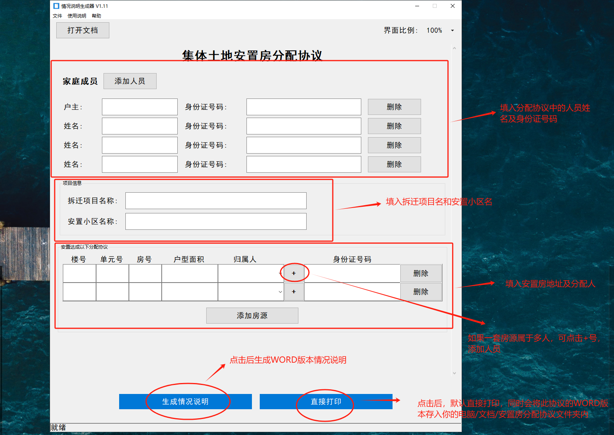

# 情况说明生成器 V1.11

## 软件介绍

情况说明生成器是一款用于生成集体土地安置房分配协议的专业工具，专为房产安置业务设计。软件采用图形化界面，使用户能够快速录入信息并生成规范的Word文档。

## 主要功能

1. **家庭成员管理**：添加、删除家庭成员及其身份证信息，第一位成员自动标记为户主
2. **身份证验证**：自动校验身份证格式和有效性，避免录入错误
3. **项目信息录入**：包含拆迁项目名称和安置小区名称
4. **安置房信息管理**：支持多套房产信息的录入与管理
5. **产权人设置**：每套房产可设置多个产权人
6. **文档生成**：自动生成标准格式的Word文档
7. **直接打印**：支持无需打开Word直接打印文档
8. **数据保存**：自动保存已录入数据，方便下次使用
9. **界面缩放**：支持70%-100%的界面缩放，适应不同显示设备

## 系统要求

- 操作系统：Windows 7/10/11
- 运行环境：无需安装Python环境
- 依赖软件：无需额外安装Office/WPS

## 使用说明

1. **数据录入**：
   - 添加家庭成员信息（户主和家庭成员的姓名和身份证号码）
   - 身份证号码会自动校验，错误会提示具体原因
   - 填写拆迁项目名称和安置小区名称
   - 添加安置房信息（楼号、单元号、房号、面积）
   - 选择每套房产的产权人（可多选）

2. **生成文档**：
   - 点击"生成情况说明"按钮，自动生成Word文档并打开
   - 文档将保存在用户"文档"文件夹下的"安置房分配协议"子文件夹中

3. **直接打印**：
   - 点击"直接打印"按钮，生成文档并直接发送到默认打印机

4. **文件管理**：
   - 软件会自动记录最近使用的文件，可从"文件"菜单快速打开
   - 点击"打开文档"按钮访问保存的所有文档

5. **界面调整**：
   - 在右上角选择界面比例(70%-100%)，调整界面大小

## 操作技巧

1. 使用回车键在表单中快速导航，类似Excel的操作方式
2. 添加多个产权人时，可点击"+"按钮为同一套房产添加多个所有者
3. 软件会自动保存操作记录，重启后可继续上次工作
4. 身份证输入完成后，系统会自动验证，错误会有具体提示

## 文件说明

- 程序数据保存在程序目录下的CONFIG文件夹
- 生成的文档保存在用户"文档"文件夹下的"安置房分配协议"文件夹

## 版本更新

### V1.11 (最新版)
- 第一位家庭成员标记为"户主"
- 增加身份证号码格式和有效性验证
- 优化用户界面和窗口尺寸
- 修复若干已知问题

### V1.1
- 增加界面缩放功能
- 优化打印流程
- 改进用户体验

### V1.0
- 首次发布版本

## 联系方式

如有问题或建议，请联系燕山乡人民政府。
